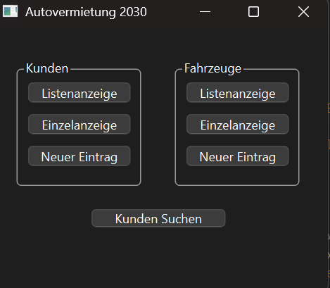
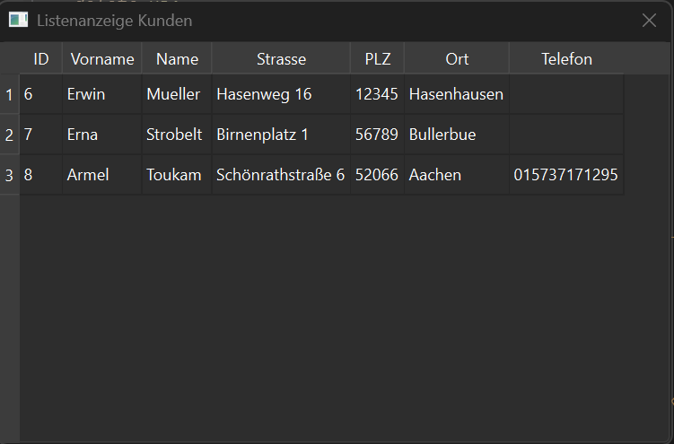
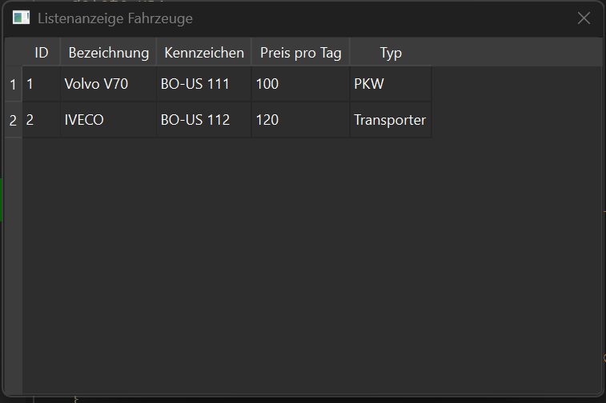

# Autovermietung 2030

Eine Desktop-Anwendung zur Verwaltung einer Autovermietung, entwickelt mit **C++**, **Qt Widgets** und **SQLite**.

Die Anwendung ermöglicht die Verwaltung von Kunden und Fahrzeugen über eine grafische Benutzeroberfläche.

---

## Technologien

Dieses Projekt wurde mit folgenden Technologien entwickelt:

- C++
- Qt Widgets
- Qt Designer
- SQLite
- QSqlTableModel
- QDataWidgetMapper
- Git / GitHub

---

## Funktionen

### Kundenverwaltung
- Kunden hinzufügen
- Kunden bearbeiten
- Kunden löschen
- Anzeige aller Kunden

### Fahrzeugverwaltung
- Fahrzeuge hinzufügen
- Fahrzeuge bearbeiten
- Fahrzeuge löschen
- Anzeige aller Fahrzeuge

### Suche
- Kundensuche über die Oberfläche

### Datenbank
- Speicherung der Daten in einer **SQLite Datenbank**

---

## Projektstruktur

mainwindow → Hauptfenster  
kundeliste → Anzeige aller Kunden  
kundeneu → Kunden hinzufügen  

fahrzeugliste → Anzeige aller Fahrzeuge  
fahrzeugneu → Fahrzeuge hinzufügen  

auto2030.db → SQLite Datenbank

---

## Projekt starten

1. Repository klonen

## Screenshots

### Hauptfenster

### Kundenliste

### Fahrzeugliste

